% title: Eclipse Trace Compass
% title_class:                  #empty, largeblend[123] or fullblend
% author: Bernd Hufmann
% author: Marc-André Laperle
% thankyou: Thank you
% thankyou_details:

---
title: Agenda

- Day 1
    - Module 1: Overview and Background
    - Module 2: Core Trace API
	- Module 3: Analysis Framework
	- Module 4: Generic State System
- Day 2
    - Module 5: Time Graph Views
    - Module 6: Timing Analysis
	- Module 7: Timing Analysis Views
	- Module 8: Custom Analysis
---
title: Approach to course

- A mix of theory and hands-on exercises
- Teams of 2
- Ask questions often and give feeback
- 9h30 to 16h30 schedule
- One hour lunch
- 15 minute break, morning and afternoon
- Please tell us if you are confused during the course

**Let's get started!**

---
title: Module 1
subtitle: Overview and Background

---
title: Trace Compass Overview

- **Framework** to build trace visualization and analysis tools

- **Scalable**: handle traces exceeding memory

- **Extensible** for any trace or log format. Binary, text, XML etc.

- **Reusable** views and widgets

- Available as standalone application or set of plug-ins

---
title: Trace Compass Overview

- **Open source** Eclipse Project

- **EPL**

- Mostly written in **Java**

<ul>
<li>Quite active, growing community:
<ul>
	<li>Academia: École Polytechnique Montréal, Concordia, others</li>
	<li>Industry: Ericsson, EfficiOS, others</li>
	<li>Government: NSERC, DRDC, NOAA (US)</li>
	<li>Kalray</li>
	<li>Windriver</li>
</ul>
</li>
</ul>

 

---
title: Trace Compass Overview

---
title: Trace Compass Overview
subtitle: Common Features

- Management of traces, trace formats and experiments

---
title: Trace Compass Overview
subtitle: Common Features

- Package export and import

---
title: Trace Compass Overview

- What is a trace in Trace Compass?
	- A Series of **events** over time
	- Each event has content **fields** (payload)

---
title: Trace Compass Overview
subtitle: Common Features

- Events Table
	- Implemented as an Eclipse "editor"

---
title: Trace Compass Overview
subtitle: Common Features

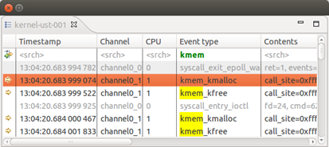

**Searching**

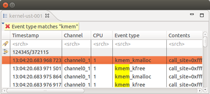

**Filtering**

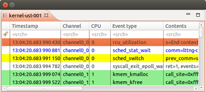

**Highlighting**

---
title: Trace Compass Overview
subtitle: Common Features

- Bookmarks and markers

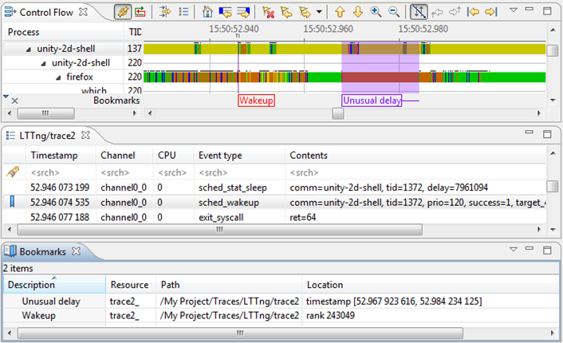

---
title: Trace Compass Overview
subtitle: Common Features

- Sequence Diagrams
	- Translates events to sequence diagram transaction
	- Extensions can define their own model

---
title: Trace Compass Overview
subtitle: State System

- State system abstracts events, analyses traces and creates models to be displayed

---
title: Trace Compass Overview
subtitle: Control Flow View

- Displays processes state changes (color-coded) over time
	- USERMODE, SYSCALL, INTERRUPED, WAIT_FOR_CPU, etc.

---
title: Trace Compass Overview
subtitle: Resources View

- Displays system resource states (color-coded) over time

---
title: Trace Compass Overview
subtitle: CPU Usage View

- Displays % of CPU used per thread over time

---
title: Trace Compass Overview
subtitle: Call Stack View

- Shows the stack trace at any point during execution

---
title: Trace Compass Overview
subtitle: Critical Path

---
title: Trace Compass Overview
subtitle: Timing Analysis

---
title: Trace Compass Overview
subtitle: Custom Text and XML Parsers

- Line based parser with regex defined in a wizard

- XML-based extracting data from XML elements and their attributes

---
title: Trace Compass Overview
subtitle: Trace correlation (Experiments)

- Trace Compass can open **multiple traces** together to view it **as one**
	- This is called an **Experiment**
- Useful for
	- Traces coming from multiple nodes
	- Different languages
	- Different layers (network, etc.)
- Traces can be manually synchronized by time or use an automatic algorithm (extensible)

---
title: Trace Compass Overview
subtitle: Integrations

- LTTng (UST, Kernel)
- Text Logs (custom parsers)
- Common Trace Format (Application, kernel, HW, Bare metal)
- Packet Capture
- BTF (Best Trace Format)
- GDB Trace Points

---
title: Common Trace Format (CTF)

- CTF is one of the trace formats understood by Trace Compass
- A **metadata** file describes the trace structure, event fields, environment, etc.
	- CTF does not describe that structure, only the language to express it.
- **Channel** files contain binary data, separate from the **metadata**. There is where the events are stored.
- **LTTng** is a well-known tracer that generates CTF traces for **Kernel** and **User Space (UST)** domains.
- Trace Compass **reads** CTF traces directly using a Java-based parser.
- Trace Compass **does not** produce CTF traces, tracers like LTTng do.
---
title: Trace Compass Overview
subtitle: References

- Project pages
	- <a href="http://tracecompass.org">tracecompass.org</a>
	- <a href="https://dev.eclipse.org/mailman/listinfo/tracecompass-dev">tracecompass-dev mailing List</a>
	- <a href="http://istmffastyet.dorsal.polymtl.ca">Is Trace Compass Fast Yet?</a>
	- <a href="http://lttng.org/">LTTng</a>
	- <a href="http://www.diamon.org/">Diamon Working Group</a>
	- <a href="http://tracingsummit.org/">Tracing Summit</a>

- Documentation
	- <a href="http://archive.eclipse.org/tracecompass/doc/org.eclipse.tracecompass.doc.user/User-Guide.html">Trace Compass User Guide</a>
	- <a href="http://archive.eclipse.org/tracecompass/doc/org.eclipse.tracecompass.doc.dev/Developer-Guide.html">Trace Compass Developer Guide</a>

---
title: The example

- 2 processes exchanging messages (over sockets)
	- **master** process
	- **challenger** process
- **challenger** sends requests to **master** which replies
- Upon reception of a request **master** executes a **processing task**
- The processing task spawns multiple workers (simulated)
- Each worker performs some calculation that vary in **duration**
- Each calculation has processing states
- We trace **master**

---
title: The example
subtitle: 

<image src="images/tracecompass_example-explained.png"/>

---
title: Module 2
subtitle: Core Trace API

---
title: Signals

- Classes can register themselves to receive various Trace-related signals
- Uses Java annotation, `@TmfSignalHandler`, to mark method that receives the signal
- Some signals: `TmfTraceOpenedSignal`, `TmfTraceClosedSignal`, `TmfTraceRangeUpdatedSignal`

~~~java
public void foo() {
    TmfSignalManager.register(this);
}

@TmfSignalHandler
public void traceClosed(TmfTraceClosedSignal signal) {
    ...
}
~~~
---
title: Steps to prepare

- In the command-line, cd to **~/workspace-traning/EclipseTraning**. 
	- Execute **git reset --hard 1af2ce**
- Execute the start script *~/workspace-training/start.tcsh*
- If you have any projects that are *not* named **External Plug-in Libraries**, remove them:
	- Right-click on the project, Delete (Do not check "Delete project contents on disk").
- You should only have *External Plug-in Libraries*
- All good?
---
title: Steps to prepare

- Go to *Plug-in Development perspective**:
    - **File->Import...->General->Existing Projects into Workspace**
    - Press **Next**
    - Press **Browse...**
    - Choose **~/workspace-training/EclipseTraining/org.eclipse.tracecompass.training.example**
    - Make sure a single project is showing and is selected
    - Press **Finish**

- Right-click on project and choose **Team->Fetch from Upstream**
---
title: How to reset to commits

- Open the History view (tab at the bottom of the screen)
- If nothing appears, click on the **org.eclipse.tracecompass.training.example**
- Right-click on the desired commit (**TRACECOMPASS2.1_START**), **Reset**, **Hard**

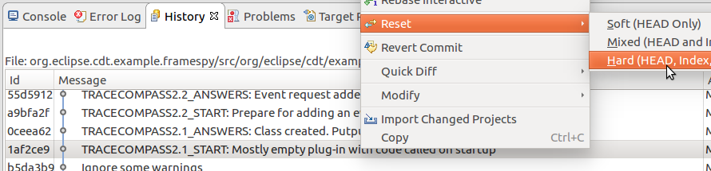

---
title: How to test

- Start the "runtime" Eclipse

<image src="images/tracecompass_runtime-launch.png"/>

- Right-click on **training_ust_001**, Select Trace Type > Common Trace Format > LTtng UST Trace.
- Open the trace in Project Explorer (double-click)

<image style="width:250px; height:auto" src="images/tracecompass_trace_open.png"/>

---
title: Exercise: Listen to a signal

- Reset to **TRACECOMPASS2.1_START** (should already have been done in previous steps)
- Create a class that will receive the signal, `EventReader`
- Instantiate the class. For now, we will do this in the `Activator` class.
- Register the class with the `TmfTraceSignalManager`
- Create a `public` method that will receive the signal:
	- Annotate your method with `@TmfSignalHandler`
	- It needs a `TmfTraceOpenedSignal` parameter
	- Make it output something to the console (System.out.println)
- <b>Go!</b>

---
title: Trace API

`ITmfTrace`

- One per trace, a central object in Trace Compass
- Knows about the key trace attributes: Number of events, file, trace type, etc.
- Allows you to seek at a location in a trace and get events one by one
- Does validation to determine whether or not a file is of this trace type (for
automatic detection, etc.)

<image src="images/tracecompass_tmftrace_class.png"/>

---

title: Event Provider

- Event providers have the capability of handling event requests.
- Often implemented in pair with `ITmfTrace` in each trace type
- Of note, `getNext()` provides the next event in the trace

<image src="images/tracecompass_tmfeventprodider_class.png"/>

---
title: Event Requests

`TmfEventRequest`

- Used to obtain series of events from an event provider (usually `ITmfTrace`)
- **Asynchronous**: Send the request and receive events one by one when they are done being parsed

~~~java
eventProvider.sendRequest(new TmfEventRequest(
        TmfEvent.class, 0, ITmfEventRequest.ALL_DATA,
        ITmfEventRequest.ExecutionType.BACKGROUND) {

    @Override
    public void handleData(ITmfEvent event) {
        super.handleData(event);
    }
});
~~~

---
title: Events

`ITmfEvent`

- Represents a single event in the trace
- Contains a **name** (event type). Use `getName()` to retrieve it.
- Contains a **time stamp**. Use `getTimestamp()` to retrieve it.
- Contains **content** (fields). Use `getContent()` to retrieve it in the form of an `ITmfEventField`. Fields can then be retrieved with `getField("myfield")` for example. Fields can also have sub-fields

~~~java

ITmfEventField field = event.getContent().getField("myfield");
if (field != null) {
    System.out.println(field.getFormattedValue());
}
~~~

---
title: Exercise: Read events from the trace

- Reset to **TRACECOMPASS2.2_START**
- In the signal handler, get the trace object from the signal parameter
- Send an event request to the trace:
	- Create an anonymous class of type `TmfEventRequest`
	- Override handleData and output the time stamp of each event to console
		- **Bonus**: Print a specific field of the event
	- When the request is **completed**, output something to the console (System.out.println)
- <b>Go!</b>

---
title: Module 2 Review

- **Signals** can be used to react to different things.
- **ITmfTrace** is a central object that validates if files are of this trace type, provides trace attributes, seeks to locations and retrieves events.
- **Event Requests** are a mean to obtain a series of events asynchronously.
- **Events** have a name, a time stamp and content (fields). Fields can have sub-fields.
- In the exercises:
	- We have used **signals**
	- We have retrieved **events** using **event requests** sent to the **trace** (`ITmfTrace`)

---
title: Module 3
subtitle: Analysis Framework

- Overview
- Analysis Module
- Plug-in extension point
- Analysis Requirements
- Analysis Parameter provider
- Dependent Analysis
- Analysis output

---

title: Analysis Framework Overview
subtitle: 

- API for integrating trace analyses
- Plug-in extension point
- Shows what can be done with trace content
- Provides hooks to add views
- Integrated with the Project Explorer
- Schedules analyses in Eclipse jobs (automatically or on demand)
- Manages dependencies between multiple analyses
- Manages requirements to execute analyses

---
title: Analysis Module
subtitle:

- All analyses implement `ITmfAnalysisModule`
- Abstract implementation `TmfAbstractAnalysisModule`
- 0..N analyses per trace or experiment

~~~java
public class ProcessingTimeAnalysis extends TmfAbstractAnalysisModule {
	public ProcessingTimeAnalysis() {}
	@Override
	protected boolean executeAnalysis(IProgressMonitor monitor) 
		throws TmfAnalysisException {
		// TODO implement logic
		return true;
	}
	@Override
	protected void canceling() {
	}
}
~~~

---
title: Analysis Module (2)
subtitle: 

- Analysis is scheduled `IAnalysisModule#schedule()`
- `IAnalysisModule#waitForCompletion()` will block thread until completion
- Use Progress monitor in `executeAnalysis()` 
	- To monitor progress
	- Handle user cancellation (important!)
- An analysis can be cancelled using `IAnalysisModule#cancel()`
- Provide help for user using `IAnalysisModule#getHelpText()`
- `TmfAnalysisManager` keeps track on available analysis per trace type

---
title: Plug-in Extension Point
subtitle: Analysis Module
content_class: smaller

- **Identifier**: org.eclipse.linuxtools.tmf.core.analysis
~~~dtd
		<!ELEMENT module (parameter , tracetype)*>
		<!ATTLIST module
		id                 CDATA #REQUIRED
		name               CDATA #REQUIRED
		analysis_module    CDATA #REQUIRED
		icon               CDATA #IMPLIED
		automatic          (true | false)
		applies_experiment (true | false) >
~~~
- **id**: The unique ID that identifies this analysis module.
- **name**: The trace analysis module's name as it is displayed to the end user
- **analysis_module**: Class that implements the `IAnalysisModule` interface.
- **icon**: The icon associated to this analysis module.
- **automatic**: Execute automatically when trace is open, or on request by users
- **applies_experiment**: If it applies to traces or experiments.

---
title: Plug-in Manifest Editor
subtitle: 

- Click on **Add...** Button
- Find org.eclipse.linuxtools.tmf.core.analysis
- Right click on org.eclipse.linuxtools.tmf.core.analysis -> New -> module
- Fill-in relevant data (id, name analysis_module)

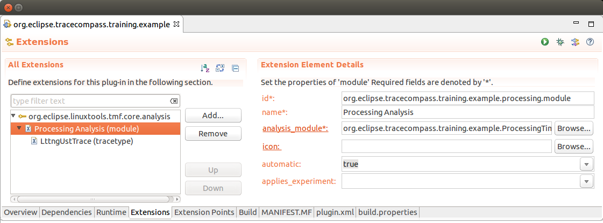

---
title: Project Explorer
subtitle: 

- Shows all available analyses under trace or experiment
- Note: Need to open trace to see available analyses

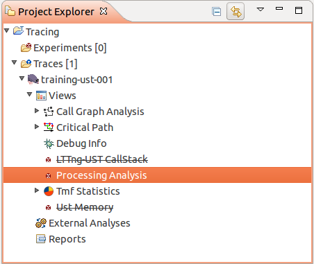

---
title: Apply to Trace Type
subtitle: 

- Define the trace type the analysis applies (or not)

~~~dtd
		<!ELEMENT tracetype EMPTY>
		<!ATTLIST tracetype
		class   CDATA #REQUIRED
		applies (true | false) >
~~~

- 
- **class**: base trace class this analysis applies to or not 
	- Note: it also applies to traces extending this class
- **applies**: Does this tracetype element mean the class applies or not (default true)

---

title: Apply to Trace Type (2) 
subtitle: 

- Right-click on analysis module -> New -> tracetype
- Fill-in the class

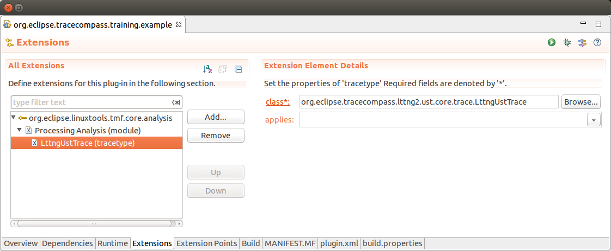

---
title: Exercise: Create an analysis module
subtitle: 
content_class: smaller

- Reset to **TRACECOMPASS3.1_START**
- Add a new analysis module by adding an extension (plugin.xml)
	- extension point: `org.eclipse.linuxtools.tmf.core.analysis`
- New module (hint: right-mouse click on added extension)
	- _id_: `org.eclipse.tracecompass.training.example.processing.module`
	- _name_: `Processing Analysis`
	- click on hyperlink **analysis_module** 
		- Class name: `ProcessingTimeModule`
		- Select **Browse...** button and find superclass `TmfAbstractAnalysisModule`
		- Remove `IAnalysisModule` interface from Interfaces list
- Output something on console (in method `executeAnalysis()`)
- continue on next slide

---
title: Exercise: Create an analysis module
subtitle: 
content_class: smaller

- Right-click on Processing Analysis -> New -> tracetype
- Click on **Browse...** and find class `LttngUstTrace`
- Run Trace Compass and Open trace training_ust_001
- **Go!**	

---
title: Exercise Review
subtitle: What we accomplished

- Defining an analysis extension
- Applying analysis to a trace type
- Implementing an analysis module class
- Running the analysis
- Exploring the integration in the Project Explorer

---

title: Analysis Requirements
subtitle: 

- 
- Provide information to user if analysis can't run
- Requirements on event types or specific event field
- Implement interface `IAnalysisRequirementProvider`

~~~java
public interface IAnalysisRequirementProvider {
	Iterable<TmfAbstractAnalysisRequirement> 
		getAnalysisRequirements();
}
~~~

---

title: Analysis Requirements (2)
subtitle: 

- Extend `TmfAbstractAnalysisRequirement` or
- Use existing classes 
	- `TmfAnalysisEventRequirement`: events by name
	- `TmfAnalysisEventFieldRequirement`: event fields for some or all events
	- `TmfCompositeAnalysisRequirement`: combine multiple ones
- Requirements have a priority 
	- e.g. `PriorityLevel#MANDATORY`, `PriorityLevel#OPTIONAL`

---
title: Analysis Requirements Example
subtitle: 
content_class: smaller

~~~java
@Override
public Iterable<TmfAbstractAnalysisRequirement> getAnalysisRequirements() {
	Set<TmfAbstractAnalysisRequirement> requirements = fAnalysisRequirements;
	if (requirements == null) {
	Set<String> requiredEvents = ImmutableSet.of(
		"ust_master:CREATE",
		"ust_master:START",
	);
	// Initialize the requirements for the analysis: events
	TmfAbstractAnalysisRequirement eventsReq = 
		new TmfAnalysisEventRequirement(requiredEvents, 
										PriorityLevel.MANDATORY);
	requirements = ImmutableSet.of(eventsReq);
	fAnalysisRequirements = requirements;
	return requirements;
}
~~~

---
title: Analysis Requirements
subtitle: Project Explorer

- If requirements are not fulfilled the analysis is strike-through
- Help text is available through context-sensitive menu

---
title: Analysis Parameter Provider
subtitle:

- Analysis may have parameters
- Default values can be set as part of analysis extension
- Add parameter provider to analysis in plugin.xml file

~~~dtd
		<!ELEMENT parameterProvider (analysisId)>
		<!ATTLIST parameterProvider
		class CDATA #REQUIRED>
~~~

- **class**: The class that contains this analysis parameter provider.
	- Implement `IAnalysisParameterProvider`
	- Extend `TmfAbstractAnalysisParameterProvider`
- Use listener to register another view to be notified when selection changes

---
title: Parameter Provider Example
subtitle:
content_class: smaller

- 
~~~java
public class MyAnalysisParamProvider extends TmfAbstractAnalysisParamProvider {
	@Override
	public String getName() {
		return "My Analysis Provider";
	}
	@Override
	public Object getParameter(String name) {
		if (name.equals("ThreadId")) {
		return new Integer("1234");
		}
		return null;
	}
	@Override
	public boolean appliesToTrace(ITmfTrace trace) {
		return (trace instanceof LttngUstTrace);
	}
}
~~~

---

title: Dependent Analyses
subtitle:

- An analysis can depend on other analyses
- Dependent analysis needs to execute beforehand
- Dependent analysis will be scheduled automatically
- Implement `TmfAbstractAnalysisModule#getDependentAnalyses()`

---

title: Dependent Analyses (2)
subtitle:
content_class: smaller

~~~java
protected Iterable<IAnalysisModule> getDependentAnalyses() {
	ITmfTrace trace = getTrace();
	if (trace == null) {
		return Collections.EMPTY_SET;
	}
	IAnalysisModule module = trace.getAnalysisModule(TidAnalysisModule.ID);
	if (module == null) {
	    return Collections.EMPTY_SET;
	}
	return ImmutableSet.of(module);
}
~~~

---

title: Analysis Output
subtitle: 

- Analysis can have one or more outputs
- Typically it's an Eclipse view
- All analysis outputs implement `ITmfAnalysisOutput`
- For Eclipse views, use class `TmfAnalysisViewOutput`
- Shown in Project Explorer under the traces
---

title: Analysis Output (2)
subtitle: 

- Associates an output with an analysis module or a class of analysis modules in plugin.xml

~~~dtd
	<!ELEMENT output (analysisId | analysisModuleClass)>
	<!ATTLIST output
		class CDATA #REQUIRED
		id    CDATA #IMPLIED>
~~~

- 
- **class**: The class of this output.
- **id**: An ID for this output. For example, for a view, it would be the view ID.

---
title: Plug-in Extension Point
subtitle: Plug-in Manifest Editor

- Right-click on `org.eclipse.linuxtools.tmf.core.analysis` -> New -> output
	- Fill in class of output and id of view
- Right-click on output -> New -> analysisModuleClass
	- Fill-in id of analysis

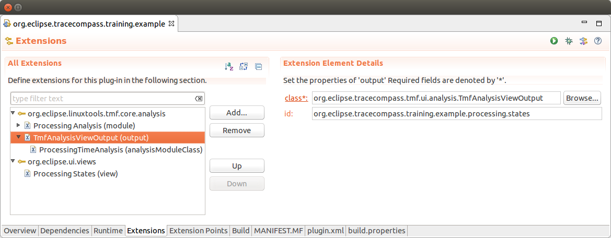

---
title: Project Explorer
subtitle: 

- Shows all available view under the analyses
- Trace needs to open to see available analyses
- Analysis requirements need to be fulfilled 

---
title: Exercise: Create an output
subtitle: 
content_class: smaller

- Reset to **TRACECOMPASS3.3_START**
- Create a Eclipse view (see Plug-in Development course)
	- _id_: `org.eclipse.tracecompass.training.example.processing.states`
	- _name_: Processing States
	- _class_: `ProcessingStatesView`
- Add an output
	- _class_: org.eclipse.tracecompass.tmf.ui.analysis.TmfAnalysisViewOutput
	- _id_: org.eclipse.tracecompass.training.example.processing.states
- Assign to analysis
	_class_: org.eclipse.tracecompass.training.example.ProcessingTimeAnalysis
- Run Trace Compass, open trace and view (from Project Explorer)
- **Go!**	

---
title: Exercise Review
subtitle: What we accomplished

- Implementing analysis output
- Opening the output from the Project Explorer
- Exploring the analysis in Project Explorer

---

title: Module 4
subtitle: Generic State System

- Generic State System Overview
- State System API
- State System Analysis Module

---

title: Generic State System Overview
subtitle: 

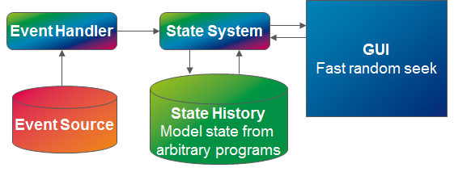

- Utility to track states over the duration of a traces
- State system abstracts events, analyzes traces and creates models to be displayed
- Persistent on disk, does not need to be rebuilt between runs
- Allows fast (O(log n)) queries of state attributes by time or type
- Support for several state systems in parallel

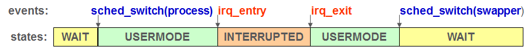

---

title: State System Definitions
subtitle:

- **Attribute**
	- Smallest element of a state
	- Has a State Value
	- Changes over time
- **Attribute Tree:** 
	- Tree-like structure
	- Each attribute can have a value and sub-attributes
	- Access attributes using a path
- **Quark**:
	- Unique, constant identifier of an attribute
	- Makes faster queries

---
title: State System Definitions (2)
subtitle:

- **State Interval**
	- State intervals are returned when querying the state system

- **State History**
	- Storage container of all the state intervals
	- Backend determines how state history is stored
	- State history can be on disk or in memory 

- **Queries**
	- Queries return state intervals
	- Full query: Whole state of model for given timestamp
	- Single query: State of a particular attribute for the given timestamp

---

title: Attribute Tree example
subtitle:

- Linux Kernel State System
- Example path: Processes/1001/PPID

~~~
	  |- CPUs
	  |  |- <CPU-number> -> CPU Status
	  |     |- CURRENT_THREAD
	  |     |- SOFT_IRQS
	  |     |  |- <Soft-IRQ-number> -> Soft IRQ Status
	  |     |- IRQS
	  |        |- <IRQ-number> -> IRQ Status
	  |- THREADS
	     |- <Thread-number> -> Thread Status
	        |- PPID
	        |- EXEC_NAME
	        |- PRIO
	        |- SYSTEM_CALL
~~~

---

title: State System API
subtitle: 

- State value interface: `ITmfStateValue`
- State interval interface: `ITmfStateInterval`
- Read and write interface to the state system: `ITmfStateSystemBuilder`
- Query interface: `ITmfStateSystem`
- Analysis using a state system: `TmfStateSystemAnalysisModule`
- All state provider implement `ITmfStateProvider`
	- Extend abstract class `AbstractTmfStateProvider`
- Create a state system and assign a backend: `StateSystemFactory`

---
title: State Value Interface
subtitle: 

- All state values implement interface `ITmfStateValue`

~~~java

public enum Type {NULL, INTEGER, LONG, DOUBLE, STRING, CUSTOM;}
~~~

- Create a state value using state value factory `TmfStateValue`, for example:

~~~java
ITmfStateValue value = TmfStateValue.nullValue();
ITmfStateValue intValue = TmfStateValue.newValueInt();
ITmfStateValue longValue = TmfStateValue.newValueLong();
~~~

---
title: State Value Interface
subtitle: 

- Read the value, for example: `IntegerStateValue`

~~~java
ITmfStateValue value = getValue();
if (value.getType() == Type.Integer) {
	int retVal = interval.getValue().unboxInt();
}
~~~

---
title: State Interval Interface
subtitle: 

- All state intervals implement interface `ITmfStateInterval`
- Has a start and end time

~~~java
long getStartTime();
long getEndTime();
~~~
	
- Provides the quark and state value

~~~java
int getAttribute();
ITmfStateValue getStateValue();
~~~

- Validates whether it intersects with a given timestamp

~~~
boolean intersects(long timestamp);
~~~

---

title: Building a state system
subtitle: ITmfStateSystemBuilder

- Main interface used during state system building: `ITmfStateSystemBuilder`
- Getting/adding an attribute quark using an absolute path 
~~~java
int getQuarkAbsoluteAndAdd(String... path);
~~~
- Getting/adding an attribute quark using a relative path
~~~java
int getQuarkRelativeAndAdd(int startingNodeQuark, String... subPath);
~~~

---

title: Building a state system (2)
subtitle: ITmfStateSystemBuilder

- Modifying a state value when state change occurs
- Note: timestamp is a long value

~~~java
void modifyAttribute(long t, ITmfStateValue value, int attributeQuark)
	throws StateValueTypeException;
~~~

- Update an ongoing state value 
	- When getting value only at the end of the state
	- e.g. return value of a function call

~~~java
void updateOngoingState(ITmfStateValue newValue, int attributeQuark);
~~~

---

title: Building a state system (3)
subtitle: ITmfStateSystemBuilder

- Push and pop a state value on a stack

~~~java
void pushAttribute(long t, ITmfStateValue value, int attributeQuark)
	throws StateValueTypeException;
~~~

~~~java
ITmfStateValue popAttribute(long t, int attributeQuark)
	throws StateValueTypeException;
~~~

---
title: State System Analysis Module
subtitle: TmfStateSystemAnalysisModule

- State system analysis modules typically extend `TmfStateSystemAnalysisModule`
- By default, full history on disk (default can be overwritten)
- Takes care of reading the trace using an event request
- Handles cancellation of analysis by user
- State systems are stored in hidden directory **.tracing** in workspace
	- `<workspace>/<project>/.tracing/<trace>/`
	- State system file is: `<analysis id>.ht`
	- Delete state systems: Right-click on trace -> **Delete Supplementary Files...**

---
title: State System Analysis Module (2)
subtitle: TmfStateSystemAnalysisModule
content_class: smaller

- Access state system using static utility method
~~~java

ITmfStateSystem myStateSystem = TmfStateSystemAnalysisModule.getStateSystem(trace, "my.analysis.id");
~~~
- Create state provider class 
~~~java
@Override
protected ITmfStateProvider createStateProvider() {
	ITmfTrace trace = getTrace();
	if (trace == null) {
		throw new IllegalStateException();
	}
	return new ProcessingTimeStateProvider(trace);
}
~~~
---
title: State provider
subtitle: 

- All state provider implement interface `ITmfStateProvider`
- Typically, extend `AbstractTmfStateProvider`
	- Uses a buffering scheme to not block event request
- Implement `ITmfStateProvider#getVersion()`
	- To force recreation of state system change return value
- Implement `ITmfStateProvider#getInstance()`
- Implement `AbstractTmfStateProvider#eventHandle()`

---
title: State provider (2)
subtitle:
content_class: smaller 

~~~java
protected void eventHandle(ITmfEvent event) {
	final ITmfStateSystemBuilder stateSystem = getStateSystemBuilder();
	switch (event.getName()) {
	case IEventConstants.CREATE_EVENT:
		// get event field with name
		String requester = 
			event.getContent().getFieldValue(String.class, "requester");

		// get quark of attribute for path Requester/<requester>
		int quark = stateSystem.getQuarkAbsoluteAndAdd("Requester", requester);

		// Create new state value
		ITmfStateValue stateValue = TmfStateValue.newValueInt
			(IEventConstants.ProcessingStates.INITIALIZING.ordinal());

		// get time of event
		long t = event.getTimestamp().getValue();

		// apply state change
		stateSystem.modifyAttribute(t, stateValue, quark);
		return;
	}
}
~~~

---
title: Exercise: Implement a state provider
subtitle:
content_class: smaller

- Reset to **TRACECOMPASS4.1_START**
- Open `ProcessingTimeAnalysis`
	- Implement createStateProvider()
	- Return an instance of `ProcessingTimeStateProvider` (class already exists) 
- Implement `ProcessingTimeStateProvider`
	- See next slides for state machine and attribute tree
- Run Trace Compass and open trace
- Open State System Explorer (Window -> Show View -> Tracing -> State System Explorer)
	- Explore state system org.eclipse.tracecompass.training.example.ht 
	- Navigate events table and follow state changes
		- Hint: add search criteria (:CREATE|:START|:STOP|:END)
- **Go!**

---
title: Exercise State Machine
subtitle: 

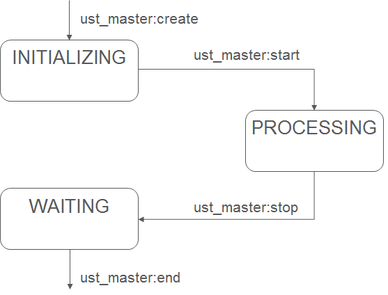

- Note: When receiving **ust_master:end** set the state to the null state!

---
title: Exercise Attribute Tree
subtitle:

 
~~~
	  |- Requester
	        |- <requester> -> State Value
~~~

- Example path: Requester/&lt;requester&gt;
	- Where &lt;requester&gt; is taken from an event field of a CTF event.
- State values:
	- 0=INITIALIZING
	- 1=PROCESSING
	- 2=WAITING

---

title: Bonus exercise: 2nd State Machine
subtitle: 

- Reset to **TRACECOMPASS4.2_START**
- Update `ProcessingTimeStateProvider` (see state machine on next slide)
	- See next slides for state machine and attribute tree
- Run Trace Compass and open trace
- Open State System Explorer
	- Explore state system org.eclipse.tracecompass.training.example.ht 
	- Navigate events table and follow state changes
- **Go!**

---

title: Example State Machine (2)
subtitle: 

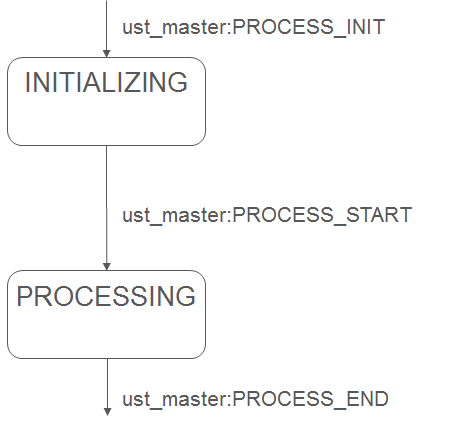

---
title: Exercise Attribute Tree
subtitle:

 
~~~
	  |- Requester
	        |- <requester> -> State Value
	              |-<id>   -> State Value
~~~

- Example path: Requester/&lt;requester&gt;/&lt;id&gt;
	- Where &lt;requester&gt; is taken from event field of CTF event
- State values:
	- 0=INITIALIZING
	- 1=PROCESSING

---
title: Exercise Review
subtitle: What we accomplished

- Overview of Generic State System APIs (for building)
- Creating a state system analysis module
- Implementing a state system provider
- Exploring of a state system using the State System Explorer
- Deleting the supplementary files

---
title: Query a state system
subtitle: ITmfStateSystem

- Main interface for accessing state system `ITmfStateSystem`
- Use after state system is built
- Throws an exception if attribute doesn't exist
- Getting a quark of an attribute from absolute path

~~~java
int getQuarkAbsolute(String... attribute)
	throws AttributeNotFoundException;
~~~

- Getting a quark from a relative path

~~~java

int getQuarkRelative(int startingNodeQuark, String... subPath)
	throws AttributeNotFoundException;
~~~

---
title: Query a state system (2)
subtitle: ITmfStateSystem

- Getting a quark of an optional attribute from absolute path

~~~java
int optQuarkAbsolute(String... attribute);
~~~

- Getting a quark of an optional attribute from relative path

~~~java

int optQuarkRelative(int startingNodeQuark, String... subPath);
~~~
- Return `#INVALID_ATTRIBUTE` (-2) if it doesn't exist

---
title: Query a state system (3)
subtitle: ITmfStateSystem

- Getting a list of quarks from a wildcarded path ("*" or "..")

~~~java
List<Integer> getQuarks(String... pattern);
~~~

- Getting a list of quarks from a wildcarded path relatively ("*" or "..")

~~~java

List<Integer> getQuarks(int startingNodeQuark, String... pattern);
~~~

- Waiting until a state system is built (with or without timeout)

~~~java
void waitUntilBuilt();
void waitUntilBuilt(long timeout);
~~~

---
title: Query a state system (4)
subtitle: ITmfStateSystem

- Querying a single state at a given timestamp

~~~java
ITmfStateInterval querySingleState(long t, int attributeQuark)
	throws StateSystemDisposedException;
~~~

- Querying full state at a given timestamp

~~~java
List<ITmfStateInterval> queryFullState(long t)
	throws StateSystemDisposedException;
~~~

---
title: Query a state system (5)
subtitle: StateSystemUtils
content_class: smaller

- Utility class to query history range
- Getting all the states for a given quark between start and end time

~~~java
public static List<ITmfStateInterval> queryHistoryRange(
	ITmfStateSystem ss, int attributeQuark, long t1, long t2)
		throws AttributeNotFoundException, StateSystemDisposedException
~~~

- Getting all the states for given a quark between start and end time with resolution

~~~java
public static List<ITmfStateInterval> queryHistoryRange(
	ITmfStateSystem ss, int attributeQuark, long t1, long t2, long resolution, 
	IProgressMonitor monitor)
		throws AttributeNotFoundException, StateSystemDisposedException
~~~

---
title: Exercise: Query a state system
subtitle: 

- Reset to **TRACECOMPASS4.4_START**
- Open view class ProcessingStatesView
	- Implement TODOs to query sate system in method print states
	- Use `ITmfStateSystem` interface and utility `StateSystemUtils` 
	- Use method `outputText()` to print text on screen
- **Go!**	

---
title: Exercise Review
subtitle: What we accomplished

- Understanding of state values and state intervals
- Getting attribute quarks
- Performing  single queries
- Performing full queries
- Querying a history range

---
title: Module 5
subtitle: Time Graph Views

- Time Graph Viewer Overview
- Time Graph Viewer Model
- Time Graph Viewer API
- Time Graph View Overview
- Time Graph View API
- Searching and Filtering in Time Graph View

---
title: Time Graph Viewer Overview
subtitle: 

---
title: Time Graph Viewer Overview
subtitle:

- Visualizes **states** over time
	- For example, processes, threads, cores, IRQs...
- Provides common features
	- Common **Time Axis** (TimeGraphScale)
	- **Marker Axis**	
	- **Navigation** with mouse, keyboard and toolbar buttons
	- **Zooming**
	- **Searching** (rows!)
	- **Highlighting** of regions of interest (makers or time selection)
- Supports drawing of **arrows**
- **Tree** structure that supports **columns**

---
title: How to create a Time Graph viewer?
subtitle: 

- Create a Time Graph viewer instance: `TimeGraphViewer`
- Define content provider to provide Time Graph Model root entries
- Define a presentation provider to define how to display states
- Define a filter content/label provider and columns for filter dialog
- Provide a Time Graph Model

~~~java
TimeGraphViewer viewer = new TimeGraphViewer();
viewer.setContentProvider(new MyTimeGraphContentProvider());
viewer.setPresentationProvider(new MyPresentationProvider);
viewer.setFilterLabelProvider(new MyFilterLabelProvider());
viewer.setFilterColumns(fFilterColumns);
viewer.setInput(getModel();
~~~

---
title: Time Graph Model
subtitle: 

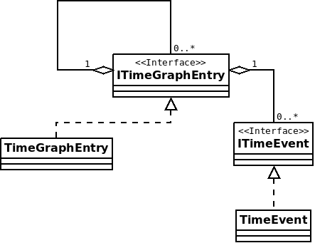

---

title: Time Graph Model (2)
subtitle: ITimeGraphEntry
content_class: smaller

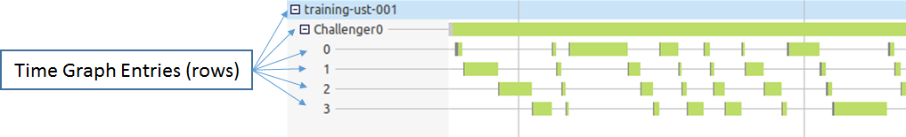

- All time graph models implement interface `ITimeGraphEntry`
- 	Typically models extend default implementation `TimeGraphEntry`
- It's a tree structure: ITimeGraphEntry has 0..* `ITimeGraphEntry` children
- Using a content provider the root entries can be supplied for a model object

~~~java
ITimeGraphEntry getParent();
List<ITimeGraphEntry> getChildren();
String getName();
boolean hasTimeEvents();
Iterator<? extends ITimeEvent> getTimeEventsIterator();
~~~

---
title: Time Graph Model (3)
subtitle: ITimeEvent

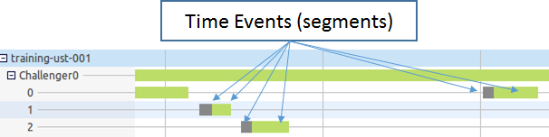

- Each `ITimeGraphEntry` has 0..* more time events
- Time events define the state intervals to be displayed
- All time events implement interface `ITimeEvent`
- Typically time events extend default implementation `TimeEvent`

~~~java
ITimeGraphEntry getEntry();
long getTime();
long getDuration();
~~~

---
title: Presentation Provider
subtitle: 
content_class: smaller

- Provides the **colors** to be used for each time event
- Defines the **tooltip** to show when hovering over a time event
- Provides possibility to draw **overlays**
- Can customizes the entry **height**
- All presentation providers implement interface `ITimeGraphPresentationProvider`
- Typically presentation provider extends `TimeGraphPresentationProvider`

~~~java
StateItem[] getStateTable();
int getStateTableIndex(ITimeEvent event);
void postDrawEvent(ITimeEvent event, Rectangle bounds, GC gc);
Map<String, String> getEventHoverToolTipInfo(ITimeEvent event);
// ...
~~~

---
title: Exercise: Create a Time Graph Viewer
subtitle: 

- Reset to **TRACECOMPASS5.1_START**
- Open view class ProcessingStatesView
- In createPartControl()
	- create new instance of TimeGraphViewer
	- set presentation provider (`ProcessingStatesPresentationProvider`)
- Implement time graph model in method fillTimeGraph() (see TODOs)
- Run Trace Compass and explore the Time Graph Viewer features
- Question: What limitations do you foresee with this implementation?
- **Go!**

---
title: Exercise Review
subtitle: What we accomplished

- Creating a Time Graph Viewer
- Setting a presentation provider
- Creating a time graph model from a state system
- Exploring of the Time Graph Viewer navigation

---
title: Time Graph View Overview
subtitle: 

- **Eclipse view** wrapping Time Graph Viewer 
- Common **abstract class** with reoccurring and reusable code
	- **Handles** and sends signals (e.g. trace opened, time range selected)
	- **Loads** the view content
	- **Provides** default set of buttons
	- Common synchronized **time axis** with other views
- Provides support for **lazy loading** of viewer
- Provides hooks to add overlay **markers**
- Support for link events, i.e. **arrows**
- Can interface with state systems

---
title: Time Graph View Overview (2)
subtitle: 

- Typically views extend abstract classes
	- `AbstractTimeGraphView`
	- `AbstractStateSystemTimeGraphView`
- Use `AbstractTimeGraphView` to populate each row at a time
	- Small number of rows
	- Works with or without state systems
- Use `AbstractStateSystemTimeGraphView` to populate all entries by time
	- High number of rows
	- Uses full state system queries (more efficient query)
	- Works only with state systems

---
title: Class Hierarchy
subtitle: 

---
title: Time Graph View API
subtitle: AbstractTimeGraphView

- **Build thread**:
	- Build list of **time graph entries** (rows)
	- Build list of **time events** for each time graph entry for **whole trace** range
		- To display coarse events before **lazy loading** of zoom window is complete
	- Called from base class for each trace in **experiment** (parentTrace)
	- Adding root entries to view using `AbstractTimeGraphView#addToEntryList()`

~~~java
protected abstract void buildEntryList(ITmfTrace trace, 
	ITmfTrace parentTrace, IProgressMonitor monitor);
~~~

---
title: Time Graph View API (2)
subtitle: AbstractTimeGraphView

- **Zoom thread**:
	- Build **time event** list for each time graph entry
	- Per **zoom** level and display **resolution**

~~~java
protected abstract List<ITimeEvent> getEventList(
	TimeGraphEntry entry, long startTime, long endTime, 
	long resolution, IProgressMonitor monitor);
~~~

---
title: Create a Time Graph View
subtitle:
content_class: smaller

~~~java
public class ProcessingStatesView extends AbstractTimeGraphView {

	// Constructor
	public ProcessingStatesView() {
		super("my.view.id", new ProcessingStatesPresentationProvider());
		// Enable entry filtering
		setFilterColumns(FILTER_COLUMNS);
		setFilterLabelProvider(new FilterLabelProvider());
	}
	@Override
	protected void buildEntryList(
		ITmfTrace trace, ITmfTrace parentTrace, IProgressMonitor monitor) {
		// TODO
	}
	@Override
	protected List<ITimeEvent> getEventList(
		TimeGraphEntry entry, long startTime, long endTime,	long resolution, 
		IProgressMonitor monitor) {
		// TODO
	}
~~~

---
title: Arrows in Time Graph View
subtitle: AbstractTimeGraphView

- Creates **arrows** between time graph entries for a given start and end time
- Computed for the current zoom window
- Providing a list of linked events implementing interface `ILinkEvent`

~~~java
protected List<ILinkEvent> getLinkList(long startTime, 
	long endTime, long resolution, 
	IProgressMonitor monitor);
~~~

- List will be propagated to TimeGraphViewer object

---
title: Markers in Time Graph View
subtitle: AbstractTimeGraphView

- Markers are **overlays** in the viewer
- Shown also on ** maker axis**
- Separated by marker category
- Bookmarks set by user in Time Graph View or externally
- Common **trace markers** can be defined per trace type
- View specific markers can be defined directly in the view class:
~~~java
protected List<String> getViewMarkerCategories();
protected List<IMarkerEvent> getViewMarkerList(long startTime, 
	long endTime, long resolution, 
	IProgressMonitor monitor);
~~~

---
title: Filtering and Searching
subtitle: 

- Possibility to provide **filter** for **time graph entries** (rows)
- Filter dialog uses a regular tree viewer 
	- Providing columns names and Label provider (extends TreeLabelProvider)
	- Optional, providing a content provider if needed 

~~~java
String[] filterColumns = { "Entry" };
setFilterColumns(filterColumns);
setFilterLabelProvider(new FilterLabelProvider());
~~~

- **Searching** for **time graph entries** is built-in:
	- Use key shortcut **CTRL+F**

---
title: Exercise: Create a Time Graph View
subtitle: 

- Reset to **TRACECOMPASS5.2_START**
- Open view class ProcessingStatesView
- Make view extend AbstractTimeGraphView
	- Implement constructor (see TODOs)
		- Call super constructor with view ID and presentation provider
		- set filter column names and label provider
	- Implement buildEntryList() (see TODOs)
	- Implement getEventList() (see TODOs)
- Run Trace Compass and explore the Time Graph View features
- Question: What are the differences to the previous exercise?
- **Go!**

---
title: Exercise Review
subtitle: What we accomplished 

- Extending the AbstractTimeGraphView
- Understanding concept of build and zoom thread
	- Implementing buildEntryList() -&gt; used in build thread
	- Implementing getEventList() -&gt; used in zoom thread
- Exploring of the Time Graph View

---
title: Time Graph View API
subtitle: AbstractStateSystemTimeGraphView

- Populate time graph entries (rows) **by time**
- **Build thread**:
	- Call queryStateSystem() in buildEntryList()

~~~java
protected void queryFullStates(ITmfStateSystem ss, long start, 
	long end, long resolution, IProgressMonitor monitor,
	IQueryHandler handler)
~~~

- Provide call back `IQueryHandler`

~~~java
public interface IQueryHandler {
	void handle(List<List<ITmfStateInterval>> fullStates,
		@Nullable List<ITmfStateInterval> prevFullState);
}
~~~

---
title: Time Graph View API (2)
subtitle: AbstractStateSystemTimeGraphView

- **Zoom thread**:
	- Builds time event list for each time graph entry
	- Per zoom level and display resolution

~~~java
protected abstract List<ITimeEvent> getEventList(
	TimeGraphEntry tgentry, 
	ITmfStateSystem ss,
	List<List<ITmfStateInterval>> fullStates,
	List<ITmfStateInterval> prevFullState, 
	IProgressMonitor monitor);
~~~

---
title: Time Graph View API (3)
subtitle: AbstractStateSystemTimeGraphView

- Providing a list of **linked events**

~~~java
protected List<ILinkEvent> getLinkList(ITmfStateSystem ss, 
	List<List<ITmfStateInterval>> fullStates, 
	List<ITmfStateInterval> prevFullState, 
	IProgressMonitor monitor);	
~~~

- Providing a list of **markers**

~~~java
protected List<IMarkerEvent> getViewMarkerList(
	ITmfStateSystem ss,
	List<List>ITmfStateInterval>> fullStates, 
	List<ITmfStateInterval> prevFullState,
	IProgressMonitor monitor);
~~~

---
title: Module 6
subtitle: Timing Analysis

---
title: Timing Analysis
subtitle: Concept

- We have two metrics to analyse, what is the data and **when** did it come.
- Every event has **time** info (time stamp), let's take advantage of that.
- Measure time between a **start** and **end** state
	- Simple: Start and end **event**
	- Often: State Machine to determine start and end
	- **Start** and **End** time : **Segment**

- Represent Execution times, latencies, latency chains etc.

---
title: Timing Analysis
subtitle: Why?

- Locate timing problems
- Analyse timing problems
- Find root cause and solution
- Potential delays (find problem before it occurs)
- Difficult to debug if it happens sporadically

---
title: Timing Analysis
subtitle: Example

- System Call Latency, e.g. futex

---
title: Timing Analysis
subtitle: Example

- IRQ Latency

---
title: Timing Analysis
subtitle: Example

- High Resolution Timer – cyclictest application of rt-tests
- Latency between timer expiry until task starts

- Latency = Δ1+ Δ2 + Δ3
	- Event 1: Timer expires
	- Event 2: Interrupt handler marks the task to react
	- Event 3: Linux scheduler switches to the task
	- Event 4: Application task begins executing

---
title: Timing Analysis
subtitle: Generalization

<ul>
<li>Time between start and end</li>
<li>Time for each transition</li>
<li>Percentage sub-duration vs total</li>
</ul>

 

---
title: Timing Analysis
subtitle: Using states

- State machine for timing analysis
	- Implementation in Java as Trace Compass extension

- Data-driven pattern matching (in XML)
	- Defining timing analyses on-the-fly

---
title: Timing Analysis API
subtitle: ISegment

- A segment provides a **start time** and an **end time**
- What that duration means is specific to the analysis that will generate it
- This interface is the basis of the "Timing" family of analysis and views

---
title: Timing Analysis API
subtitle: ISegmentStore

- Stores segments (`ISegment`)
- Extends "well known" Java `Collection` interface
	- `iterator()`, `add()`, `isEmpty()`, etc.
- Adds the notion of intersection: `getIntersectingElements`(start, end)

---
title: Timing Analysis API
subtitle: Limitations

- **WARNING**: Current segment store implementations are loaded **fully into memory**.
- If your trace will generate many segments, Trace Compass might **run out of memory**.

- This will likely be fixed in the near future versions of Trace Compass.

---
title: Timing Analysis API
subtitle: AbstractSegmentStoreAnalysisModule

- Similar to normal analysis but with the notion of segments
- **Builds** segments and **stores** them: `buildAnalysisSegments()`
- Provides the segment store (for views, etc.): `getSegmentStore()`

---
title: Exercise: Create segment store module

- Reset to **TRACECOMPASS6.1_START**
- `ProcessingLatencyModule` is created for you with some **TODOS**. plugin.xml is already filled.
	- Populate the list of aspects (columns) to be used by some views. **Hint**: Reused some of the existing classes in the package.
	- Create the analysis request. This class has the responsibility of filling the segment store.
	- Complete the **processEvent** helper method. This should handle events one by one and adds segments to the segment store. Note that we need two event (start and end) so we need to keep track of ongoing ones. 
	- Return all the list of aspects to be used: `Name` and `Content`

---
title: Module 6 Review

- **Segments** (`ISegment`) are defined by a start and an end time. They can represent things like execution times, latencies, etc.
- Multiple segments can represent **latency chain**. For example multiple sub-steps of a process.
- State systems can help generalize the creation of segments
- **ISegmentStore** stores segments like a Java Collection but with intersection methods
- **AbstractSegmentStoreAnalysisModule** helps building segments, storing them and providing them to clients (views).
- In the exercise: We have created a **segment-based analysis module** that creates segments and stores them in a segment store which will be available for our views.

---
title: Module 7
subtitle: Timing Analysis Views

---
title: Timing Analysis Views
subtitle: Overview

- Several types of views can be added that make use of segment store analysis
	- Latencies (table)
	- Statistics
	- Scatter chart
	- Density

- Most of those views follow a similar pattern:
	- An abstract viewer to help create the widgets specific to the type of view
	- An abstract view class to help create the container this type of view and that will create the chosen viewer
	- This is similar to Time Graph views VS Time Graph Viewer

---
title: Timing Analysis Views
subtitle: Overview

- Viewers query analysis based on segment stores (see previous module!)

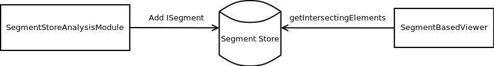

---
title: Latency Table view

- The Latency view displays segments in a simple table format.

	(Example based on System Calls analysis)

---
title: Latency Table view
subtitle: API

- `AbstractSegmentStoreTableView`
	- An abstract class that helps create a table view.
	- `createSegmentStoreViewer`: has to return an AbstractSegmentStoreTableViewer

---
title: Latency Table view
subtitle: API

- `AbstractSegmentStoreTableViewer`
	- An abstract class that helps create a table viewer.
	- `createProviderColumns`: can be overridden to have greater influence on columns (order, etc.).
	- `getSegmentStoreProvider`: returns which analysis module will provide the segment store
~~~java
@Override
protected ISegmentStoreProvider getSegmentStoreProvider(ITmfTrace trace) {
    return TmfTraceUtils.getAnalysisModuleOfClass(trace, SystemCallLatencyAnalysis.class, SystemCallLatencyAnalysis.ID);
}
~~~

---
title: Exercise: Create a Latency Table

- Reset to **TRACECOMPASS7.1_START**
- Create class `ProcessingLatencyTableViewer`, select super class (extends)  `AbstractSegmentStoreTableViewer`
	- Implement method `getSegmentStoreProvider`
- In plugin.xml, create the missing class `ProcessingLatencyTableView` (tip: click the hyperlink to bring up the New Class wizard). Select super class (extends)  `AbstractSegmentStoreTableView`.
	- Implement `createSegmentStoreViewer` in `ProcessingLatencyTableView`
- <b>Go!</b>

---
title: Statistics view

- The Statistics view displays statistics for each segment type
	- You can also navigate to the minimum and maximum of each segment type from this view (eg. longest `futex` system call)

---
title: Statistics view
subtitle: API

- `AbstractSegmentStatisticsAnalysis`
	- An abstract class that helps create a statistics module reusing an existing segment store provider (i.e. another module).
	- `getSegmentType`: returns the segment type to compute the statistics for.
	- `getSegmentProviderAnalysis`: returns an existing segmentstore provider.

~~~java
@Override
protected ISegmentStoreProvider getSegmentProviderAnalysis(ITmfTrace trace) {
    return TmfTraceUtils.getAnalysisModuleOfClass(trace, SystemCallLatencyAnalysis.class, SystemCallLatencyAnalysis.ID);
}
~~~

---
title: Statistics view
subtitle: API

- `AbstractSegmentStoreStatisticsView`
	- An abstract class that helps create a statistics view.
	- `createSegmentStoreStatisticsViewer`: has to return an `AbstractSegmentStoreStatisticsViewer`

- `AbstractSegmentStoreStatisticsViewer`
	- An abstract class that helps create a statistics viewer.
	- `createStatisticsAnalysiModule`: returns which analysis module will provide the statistics.
	- `updateElements`: creates and updates items in the statistics tree. This is where a hierarchy can be created.

---
title: Exercise: Create a Statistics View

- Reset to **TRACECOMPASS7.2_START**
- Create a class `ProcessingLatencyStatisticsModule` with super class (extends) `AbstractSegmentStatisticsAnalysis`
	- Implement `getSegmentType()`: In our example, it's the name of the segment
	- Implement  `getSegmentProviderAnalysis`
- `ProcessingLatencyStatisticsViewer` is created for you with some **TODOS**.
	- Return a new instance of the statistics module (see previous steps)
	- Build the statistics tree by creating new entries
- In plugin.xml, create the missing class `ProcessingLatencyStatisticsView` (tip: click the hyperlink to bring up the New Class wizard). Select super class `AbstractSegmentStoreStatisticsView`.
- <b>Go!</b>

---
title: Scatter chart

- The Scatter view displays the segment durations over time in a 2D plot chart
	- Each dot represents the time it ended on the X-axis and its duration on the Y-axis
	- Makes it possible to spot **outliers**

---
title: Scatter chart
subtitle: API

- `TmfChartView`
	- An abstract class that helps create a view based on a chart (SWTChart)
	- `createChartViewer`: has to return an `TmfXYChartViewer` (which `AbstractSegmentStoreScatterGraphViewer` extends).

- `AbstractSegmentStoreScatterGraphViewer`
	- An abstract class that helps create a scatter viewer.
	- `getSegmentStoreProvider`: returns which analysis module will provide the segment store

---
title: Exercise: Create a Scatter View

- Reset to **TRACECOMPASS7.3_START**
- Create class `ProcessingLatencyScatterGraphViewer`, select super class (extends)  `AbstractSegmentStoreScatterGraphViewer`
	- Implement method `getSegmentStoreProvider`
- In plugin.xml, create the missing class `ProcessingLatencyScatterView` (tip: click the hyperlink to bring up the New Class wizard). Select super class (extends)  `TmfChartView`.
	- Implement `createChartViewer` 
- <b>Go!</b>

---
title: Density view

- The Density view displays the segment durations on the frequency domain.
	- Each bar represents the **duration** of the segment on the **X-axis** and the **count** of segments on the **Y-axis**

 
- In other words, fast system calls are on the left and slow system calls are on the right

---
title: Density view
subtitle: API

- `AbstractSegmentStoreDensityView`
	- An abstract class that helps create a density view
	- `createSegmentStoreTableViewer`: has to return an `AbstractSegmentStoreTableViewer` (can reuse the one from Latency table view!). Left part of the view.
	- `createSegmentStoreDensityViewer`: has to return an `AbstractSegmentStoreDensityViewer`. Right part of the view.

- `AbstractSegmentStoreDensityViewer`
	- An abstract class that helps create a density viewer.
	- `getSegmentStoreProvider`: returns which analysis module will provide the segment

---
title: Exercise: Create a Density View

- Reset to **TRACECOMPASS7.4_START**
- Create class `ProcessingLatencyDensityViewer`, select super class (extends)  `AbstractSegmentStoreDensityViewer`
	- Implement method `getSegmentStoreProvider`
- In plugin.xml, create the missing class `ProcessingLatencyDensityView` (tip: click the hyperlink to bring up the New Class wizard). Select super class (extends)  `AbstractSegmentStoreDensityView`.
	- Implement `createSegmentStoreTableViewer` : Reuse the one from Latency Table view!
	- Implement `createSegmentStoreDensityViewer`
- <b>Go!</b>

---
title: Module 7 Review

- Many views can be built by reading a **segment store**.
- In the exercises, we have created:
	- **Latency Table** view
	- **Statistics** view
	- **Scatter chart** view
	- **Density** view
- Those views can be generated by follow a similar patter of creating a **viewer inside a view**, and specifying the segment store to use.

---
title: Module 8
subtitle: Custom Analysis

---
title: XML analysis basic
subtitle:

- The joys of XML analysis
	- Customize Trace Compass without recompiling
	- Add custom analysis
	- Add custom and reusable views
	- Share analysis and views
	- Find an execution flow within the trace

---
title: XML analysis basic
subtitle: Advanced pattern matching
content_class: smaller

- Find **stateful** sequence within the trace

---
title: XML analysis basic
subtitle: Advanced pattern matching
content_class: smaller

- XML description

~~~xml
<fsm id="process:processing">
	<precondition event="ust_master:PROCESS_START"/>
	<precondition event="ust_master:PROCESS_END"/>
	<initialState>
		<transition event="ust_master:PROCESS_INIT" 
			target="INITIALIZING" action="process_init:save_id"/>
	</initialState>
	<state id="INITIALIZING">
		<transition event="ust_master:PROCESS_START" cond="test_id" 
			target="PROCESSING" action="process_start"/>
	</state>
	<state id="PROCESSING">
		<transition event="ust_master:PROCESS_END" cond="test_id" 
			target="END" action="process_end"/>
	</state>
	<final id="END"/>
</fsm>
~~~

---
title: XML analysis basic
subtitle: Generic views

XML **Time graph view**

 

XML **XY View**

 

**Timing analysis** on-the-fly

---
title: How do we use an XML analysis?
subtitle:

**Define** the analysis

 

**Import** an XML analysis

 

**Analyze** result in Trace Compass

 

---
title: Exercise: Importing the XML analysis
subtitle:
content_class: smaller

- Reset to commit **TRACECOMPASS8.1_START**
- In the project explorer,
    - Expand the tracing project
    - Right-click the Traces folder
    - Select `Manage XML analyses...`
    - In the opened dialog import the `training-example-full-states.xml` file and close the dialog.
- The analysis with the name `Processing Analysis XML` is now installed
- The analysis is present under the trace _training_ust_001_

---
title: Exercise: Importing the XML analysis
subtitle:

---
title: Exercise: Execute the XML analysis
subtitle: 

- Open the trace.
	- The `Processing Analysis XML` analysis should be now expandable.

- Expand the analysis. Several views are present under it.
- Open the view named `Processing States XML`

---
title: Exercise: Observe the analysis 
subtitle: 

- A timegraph view opens and is `populated`

- Some **entries (rows) are empty**. Why?
- **The state system is probably not well designed**
- Let's take a look at the XML file

---
title: Exercise: Edit the analysis
subtitle: 

- Reopen the **Manage XML analyses...** dialog (seen previously)
- Select **training-example-full-states** and click on the 'Edit' button

- The XML file opens in an editor

---
title: Exercise: Edit the analysis
subtitle: 

- We can see that there are some `stateChange` where the  `stateValue` is set to **null**.
~~~xml
<stateValue type="null" />
~~~

- We probably don't want to set the value to **null** for the `ust_master:PROCESS_INIT` and `ust_master:PROCESS_START` events.
  
- Let's edit the XML file

---
title: Exercise: Edit the analysis
subtitle: 

- Change the **stateValue** for event `ust_master:PROCESS_INIT` to `$INITIALIZING`
~~~xml
    <stateValue type="int" value="$INITIALIZING"/>
~~~

- Change the **stateValue** for event `ust_master:PROCESS_START` to `$PROCESSING`
~~~xml
    <stateValue type="int" value="$PROCESSING"/>
~~~

- Save the file. The open trace should close. 
- Reopen the trace and the view

---
title: Exercise: Edit the analysis
subtitle:

- The view is populated. There is **no empty entry**.

---
title: Exercise review
subtitle:

- In the exercise, we have
	- Imported an XML analysis
	- Edited the XML analysis
	- Executed the XML analysis and analyzed the data

---
title: Exercise: Timing Analysis
subtitle:

- Reset to commit **TRACECOMPASS8.2_START**
- Import the **training-example-processing-timing.xml** file

- The analysis with the name `Processing Latency XML` is now installed
- The analysis is present under the trace _training_ust_001_

---
title: Timing Analysis
subtitle:

- Reopen The trace
    - Several views are now present under the analysis.
    
<left></left>

- Open all 4 latency views

---
title: Exercise: Observe the analysis
subtitle:

- All the views are empty
	- **The analysis probably does not create any latency data**
  
- Let's take a look at the XML file

---
title: Exercise: Edit the analysis
content_class: smaller 

- Open the XML file (using Edit)
- The file contains an action that creates latency data (segments) in the file
~~~xml
    <action id="processing_endeded">
        <segment>
          <segType segName="PROCESSING" />
          <segContent>
            <segField name="requester" type="string">
              <stateValue type="eventField" value="requester" />
            </segField>
            <segField name="id" type="string">
              <stateValue type="eventField" value="id" />
            </segField>
          </segContent>
        </segment>
      </action>
~~~
- **This action is never used**
 
- Let's edit the XML file

---
title: Exercise: Edit the analysis
subtitle:

- We need to call the action when the processing ended (when we receive the `ust_master:PROCESS_END` event).
- Let's add an action to the `ust_master:PROCESS_END` event transition.

~~~xml
<transition event="ust_master:PROCESS_END" target="end" cond="cond_same_data" action="processing_endeded" />
~~~

- Save the file. The open trace should close. 
- Reopen the trace and the latency views
- The views are now **populated**.
- The latency views and content are the same as the Java analysis

---
title: Exercise: Analysis result
subtitle:
content_class: smaller

---
title: Exercise Review
subtitle: 

- In the exercise, we have:
	- Generated latency data using XML analysis
	- Analyzed latencies based on XML analysis
	- Visualized latency data in various latency views 

---
title: Module 8 review
subtitle: What we have seen

- In this module, we have:
	- Learned how to `import an XML analysis`
	- Learned how to `execute the analysis` and analyze the data
	- Learned how to `edit the analysis`
	- Learned how to `generate latencies data` from the XML analysis
	- Learned how to `analyze latencies` based on XML analysis
